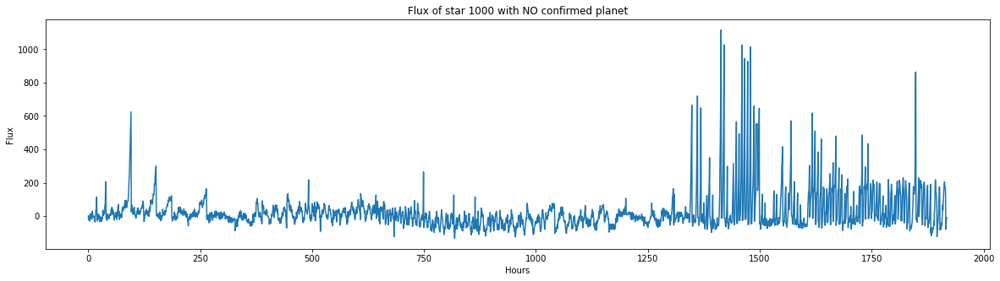

# Transit Exoplanet Detection via Machine Learning #
Scientists use data collected by space telescopes to find new information that allows us to learn more about the universe. The NASA Kepler space telescope has been collecting light from thousands of stars for many years to detect the presence of exoplanets.

An exoplanet is a planet that orbits a star, just like the Earth; however these systems are hundreds or thousands of light years away from Earth, so it is essential to have tools that can assist scientists in understanding whether a given star is likely to have exoplanets. The data collected by space telescopes is huge and new artificial intelligence techniques enable advanced data analysis and powerful predictive models.

In this project we used a dataset from the kaggle site, coming from the Mikulski Archive, a large archive of astronomical data for classifying the light curve of the stars to check the presence of the exoplanets. We applied different feature engineering techniques to the dataset and then we will present a neural network ( CNN ), which is a strong model in Deep Learning for time series classification ( TSC ), and a SVC model which will be used for classifying the brightness flux of stars. We will compare these 2 models in this task and this will show how a deep learning approach in this problem achieves a great performance. Since the measure of brightness is a standard in these applications, these predictive models can be useful for future works with other and new larger dataset.

## Dataset ##
The dataset that we've used is a kaggle dataset : https://www.kaggle.com/keplersmachines/kepler-labelled-time-series-data

This contains data of the luminosity flux of over 5000 stars. Precisely the dataset has dimensions (5087, 3198), which the first column is the target value. An important thing to consider is the fact that the dataset is unbalanced. There are very few positive examples, less than 1% of the entire training set and the same in the test set. Here below we can see an example of signals and the respective smoothed version.

## Machine Learning Model ##
For this task, we used a CNN and a SVC. CNN ( Convolution Neural Newtork ) is probably one of the most famous nerual network in deep learning; SVC ( Support Vector Classifier ) is a Machine Learing model that has good performance and could approach the results of deep neural network. Above you can find a Report when you can read all the details and the results, even the References.

## Code and Implementation ##
A gaussian filter (with sigma = 5) was applied to the signals to remove some noise from the signals and then we applied the FFT to the data to obtain the frequency domain. Machine learning models work with data in the frequency domain.
## Testing and Performance Evaluation ##
We've presented all the performance classification metrics: Accuracy, Recall, F1 Score
## Results ##
The CNN has achieved good results. With all the problems written above with a sufficient number of epochs (according to our tests they must be greater than 15) the model is able to detect 5 exoplanet in the test set ( 100 % accuracy ). However the SVC fails the recognition of 4 exoplanets ( 1 is predicted correctly ).

## Future work ## 
In the field of applied astrophysics the transit detection of exoplanets is an important technique for the discovery of new planets. It would be very interesting to test our models ( in particular CNN ) in new larger datasets. Recall that in the MAST archive ( Mikulski Archive for Space Telescopes ) it is possible to obtain the light curves of thousands of other stars collected by the Kepler Telescope. However these data are not in a form directly usable by a machine learning model and therefore would require to be downloaded and processed to extract the light curves.
